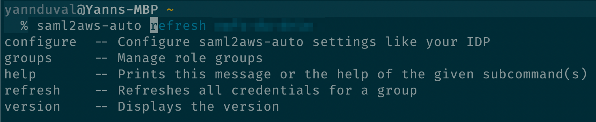
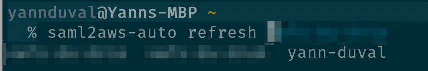
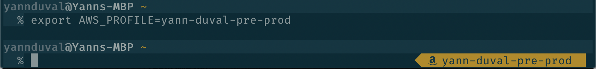
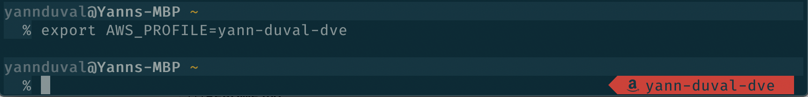
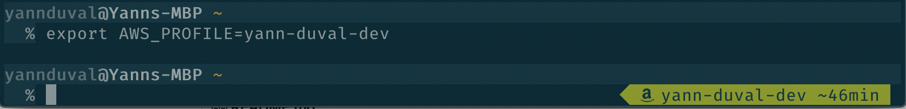

# zsh-saml2aws-auto

ZSH plugin for [saml2aws-auto](https://github.com/Rukenshia/saml2aws-auto)

## Prerequisites

* Oh my zsh
* [A font with icons - I use FiraCode](https://github.com/ryanoasis/nerd-fonts/tree/master/patched-fonts/FiraCode)

## Installation

`git clone https://github.com/devndive/zsh-saml2aws-auto.git $ZSH_CUSTOM/plugins/zsh-saml2aws-auto`

Enable the plugin in your `~/.zshrc` by adding `zsh-saml2aws-auto` to your plugins.

To get the indicators in your prompt add

`RPROMPT='$(aws_profile)'`

## Features

When using multiple AWS profiles, e.g. different accounts for your stages (development, pre-prod, prod), I like to see which profile is currently exported and if the token is still valid.

### An alias s2a
The plugin will export an alias for you:

`alias s2a="saml2aws-auto"`

### Basic autocompletion for saml2aws-auto

Completing commands

Completing groups

### Which profile is currently exported?
Image you have a group configured with the following entries:

* yann-duval-dev
* yann-duval-pre-prod

Now you would export the pre-prod profile

`export AWS_PROFILE=yann-duval-pre-prod`

To easily identify typos the indicator will be red

### How long is the session valid for?
If you are running a command that might take sometime, eg. deleting a CloudFront distribution, it helps to know how long your session is valid for

